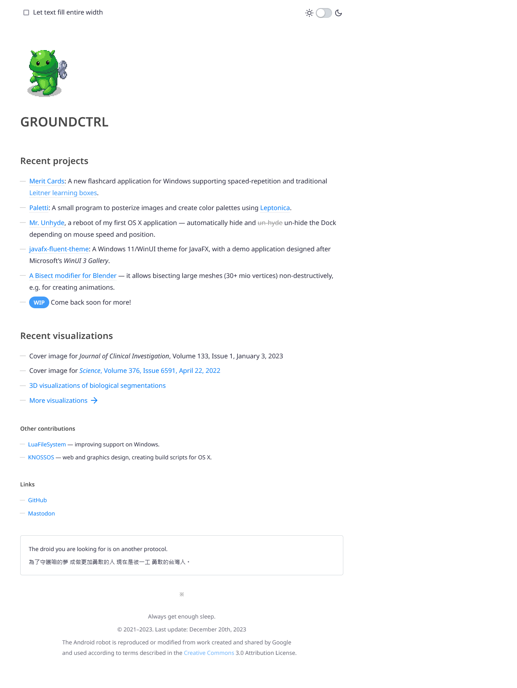

# jekyll-hypertext-theme

This is the theme which I use on my websites, and put into its own repository so that I can import it easily.

It’s called _Hypertext_, in memory of the original web.



## Features

* Single-column layout with about 20 words per line
* A checkbox to remove this maximum width and let text fill the entire viewport
  * The checkbox works entirely without JavaScript; if JavaScript is available, user choice is persisted in `localStorage`
  * Hidden if viewport is so small that text is full-width anyway
* A switch to toggle dark mode
  * Persists user choice to `localStorage`; if no JS is available, then CSS' `prefers-color-scheme` is used
  * Animations are skipped on initial load so that there is no sudden theme change
* No fixed font size to account for user preference (set in the browser)
* CSS is put into `<head>` (only on landing page) to improve loading speed

Noto Sans (400, 600) is included in `assets/fonts/`, and currently sub-set to Latin characters which yields about 20&nbsp;KB per file.

## License

This project is published under the zlib license (see `LICENSE` file in this repository).

```
Copyright (C) 2023 Eroica

This software is provided 'as-is', without any express or implied
warranty. In no event will the authors be held liable for any damages
arising from the use of this software.

Permission is granted to anyone to use this software for any purpose,
including commercial applications, and to alter it and redistribute it
freely, subject to the following restrictions:

1. The origin of this software must not be misrepresented; you must not
   claim that you wrote the original software. If you use this software
   in a product, an acknowledgment in the product documentation would be
   appreciated but is not required.
2. Altered source versions must be plainly marked as such, and must not be
   misrepresented as being the original software.
3. This notice may not be removed or altered from any source distribution.
```
